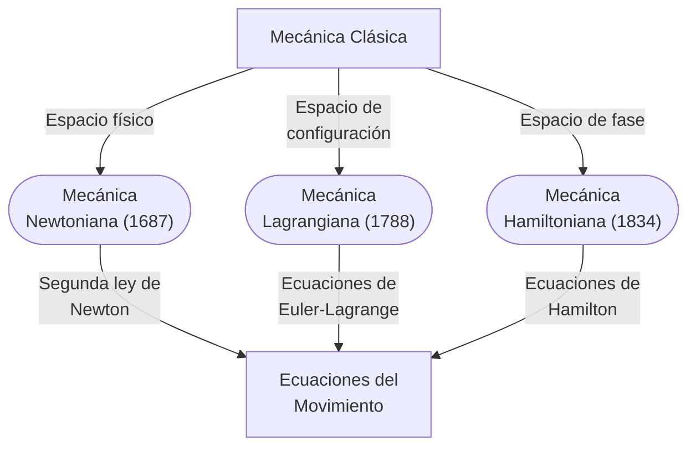

## Vistazo de la mecánica clásica

<figure>

<figcaption>

Figura 1. Relación entre las formulaciones newtoniana,
lagrangiana y hamiltoniana de la mecánica clásica.
Adaptado de SolisPhD.[^classical-mechanics-overview]

</figcaption>

</figure>

\[
\begin{array}{ccc}
\text{Newton} & \text{Lagrange} & \text{Hamilton} \\
\mathbf{F} = \dfrac{d\mathbf{p}}{dt} & L = T - V & H = T + V
\end{array}
\]

[^classical-mechanics-overview]: SolisPhD, "FS534 Lección I", YouTube, publicado el 14 de agosto de 2025, consultado el 11 de agosto de 2026, [youtube.com/watch?v=rYN3zkj2A7Y](https://www.youtube.com/watch?v=rYN3zkj2A7Y).

## "Casos especiales" y su utilidad

<!--
qué son los casos especiales y si son de utilidad?
por ejemplo
- Newton cuando v<<c
- asumir dinámica ideal para formular otras expresiones/interpretaciones

explicarlo desde los puntos de vista de los 3 formalismos
-->

## Intuitividad

<!--
explicarlo desde los puntos de vista de los 3 formalismos
(Lagrange no tendría intuitividad?)
-->

## Compatibilidad de marcos teóricos

> "Un buen marco teórico es aquel capaz de producir hechos y observaciones que también puedan ser reconocidos y explicados fuera de su propio marco".[^fragility-of-physics]

[^fragility-of-physics]: Luke Smith, "The Fragility of Physics", Luke Smith's Webpage, consultado el 10 de agosto de 2026, [lukesmith.xyz/articles/the-fragility-of-physics](https://lukesmith.xyz/articles/the-fragility-of-physics/). Traducción propia.

<!--
Ejemplos como péndulo simple u órbitas planetarias
-->

## Filosofía

<!--
Entrevistar a físicos para conocer su posición al respecto?
-->
